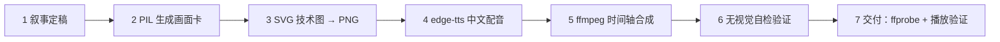

# Explainer Video Builder · 中文技术讲解视频制作

把一套技术方案 / 项目成果做成一分钟级（60–120s）带中文配音、有叙事节奏的 1080p 横屏讲解视频。画面用白底学术卡 + 规范 SVG 架构图 + 实测画面演示，配音用 edge-tts 中文男声，ffmpeg 按时间轴自动合成，全程可脚本化复现。

## 为什么这样做

讲解视频的成败在"画面规范 + 叙事节奏 + 配音同步"，三者缺一不可：

- **白底学术风**最不易出错：纯白底、黑色大字、单一强调色下划线，观众第一眼就知道这是正式汇报；深色科技风滥用容易脏。
- **SVG 架构图必须按高星 skill 的 Flat Icon 规范**：细边框、tint 色图标、正交走线、对齐网格，才配得上"美观"二字。随手画的粗线大色块经不起放大看。
- **先文字预告再放实测视频**：观众不知道接下来要发生什么时，实测画面没有意义；一句"下面展示实测效果"建立预期。
- **配音与画面按时间轴逐段对齐**：先排画面段边界，再把每段配音用 `adelay` 精确落位，否则"画外音"变成"追着画面跑"。

## 工作流总览

详细配方：画面卡规范看 `references/cards.md`，SVG 规范看 `references/flat-icon-graph.md`，合成配方与坑看 `references/ffmpeg-recipes.md`，验证方法看 `references/verification.md`。

## 1. 叙事定稿（先于任何技术工作）

开工前先在文字层面把整支视频的段、时长、配音文案定死，做成时间轴表。标准九段结构（时长可缩放）：

| # | 段 | 画面 | 作用 |
|---|---|---|---|
| 1 | 片头 | 深蓝横幅白字标题卡 | 报幕：项目名 + 一句话副题 |
| 2 | 背景 | 白底 + 应用场景图片 | 讲应用场景（灾害搜救/监测/巡检……） |
| 3 | 痛点 | 白底 + 红点要点 | 讲现状问题（高时延/丢包/画面劣化） |
| 4 | 方案 | 白底 + 蓝点要点 | 讲核心技术原理 |
| 5 | 架构 | SVG 技术图 | 讲系统架构与数据流 |
| 6 | 闭环 | SVG 技术图 | 讲反馈/闭环机制 |
| 7 | 实测预告 | 深色渐变 + 大字预告卡 | **先预告再放视频**，给观众预期 |
| 8 | 实测 | 真实视频等比居中 + 两侧渐变 | 展示真实效果，铁证 |
| 9 | 结束 | 白底居中大字 | 收尾署名 |

- 每段时长由配音文案长度推算（中文约 4.5 字/秒），全片控制在 60–120s。
- **数据口径以用户提供的权威文档（复盘/报告/实验日志）为准，绝不编造新指标。**
- 实测段若用真实视频，先检测并确认黑屏/废段边界，再定段长（见 references/verification.md）。

## 2. 画面卡片（PIL + Noto Sans CJK）

用 `scripts/make_cards.py` 模板生成全部静态卡。白底学术风规范：

- 画布 1920×1080，纯白底 `(255,255,255)`，正文黑 `(20,20,25)`、次级 `(60,60,70)`。
- 强调色：蓝 `(0,90,200)` 表方案/主流程，红 `(200,40,40)` 表问题/痛点，绿 `(0,140,90)` 表成功。**单卡只用一种强调色**。
- 版式：标题 56px Bold 左上，标题下 5px 强调色下划线（`d.line` 宽度 5），要点圆点 42px Bold，正文 38–40px。
- 中文字体用系统 Noto Sans CJK（`/usr/share/fonts/opentype/noto/NotoSansCJK-*.ttc`）。
- **预告卡**：深色渐变底（左右对称），上下两条细装饰线 + 居中大字。装饰线与任何文字保持 ≥40px 间距（用 `textlength` 量宽、用字号推算高，防重叠）。
- 实测段的背景卡：左右对称深色渐变（两侧深、中间浅），配合居中视频，**不用模糊背景**——模糊显得脏，渐变干净。

## 3. 技术图（SVG，按 Flat Icon 规范）

架构图/流程图用 SVG 手写，规范细节见 `references/flat-icon-graph.md`。要点：

- 白底，节点白底 `#d1d5db` 细边框 `rx=8`，组件 400×96（1920 画布）。
- 44px 彩色 tint 图标（蓝 `#eff6ff` / 红 `#fef2f2` / 橙 `#fff7ed` / 灰 `#f3f4f6`）。
- 主流程箭头 `#2563eb`，反馈 `#dc2626` 虚线，箭头 3px（1920 画布 = 2x）。
- 走线正交（横平竖直），跨线标签用白底遮断；全部坐标对齐 8px 网格，组件间距 ≥64px。
- 三列布局：发送端 / 公网 / 接收端，每列一个浅 tint 大区域框 + 28px 区域标题。
- 渲染：用 **chrome headless**（`--screenshot --window-size=1920,1080`），比 rsvg 更接近浏览器效果。

## 4. 中文配音（edge-tts）

- 逐段生成配音，每段对应一个画面段或连续几段。
- 用 `zh-CN-YunxiNeural`（男声）为主；语速默认，必要时 `--rate=+8%`。
- 记录每段音频起始时间偏移（毫秒），供合成用。参考 `scripts/make_tts.py`。
- 配音文案在叙事阶段就定稿，别边做边改。

## 5. ffmpeg 时间轴合成

配方与坑全量见 `references/ffmpeg-recipes.md`。流程：

1. 每段静态卡 → `-loop 1` + `fade` 淡入淡出 → 独立 mp4（无音轨）。
2. 实测段：源视频等比缩放居中 + 两侧渐变背景 overlay，**`-t` 作输出选项放在输出文件之前**，精确截断。
3. 全部配音段 `aresample + aformat + adelay(偏移)` → `amix`，音量补偿 + `apad` 对齐总长。
4. 混入低音量背景乐（ffmpeg 合成或用户提供），结尾 `afade` 淡出 + `alimiter=limit=0.95` 防削波。
5. `concat` 拼接画面段，最后合并音视频出 MP4（H.264 + AAC + faststart）。

## 6. 无视觉自检验证

无图形界面环境下照样自查，方法见 `references/verification.md`：

- `ffprobe` 查时长/分辨率/编码，确认每段边界与计划一致（特别是被截断的实测段）。
- 抽帧用 PIL 做像素亮度采样：黑屏段=上部亮度骤降 0；页面空白=全图近似白色。
- `tesseract` OCR 检查文字完整、无重叠、无乱码。
- 用 PIL 在已知坐标检查通道线/箭头/标签颜色，审查走线是否穿字。

## 7. 交付

- 输出 1920×1080 H.264+AAC MP4，`-movflags +faststart`。
- 若系统缺 H.264/AAC 解码导致 totem 等打不开：装 `gstreamer1.0-libav gstreamer1.0-plugins-bad gstreamer1.0-plugins-ugly`（Ubuntu）。
- 交付时告知用户文件路径，可 `xdg-open` 打开所在文件夹。

## 铁律

- **所有素材只读引用，绝不修改原文件**（实测视频、截图、报告、数据文档一律不动，只读进合成）。
- **视频内数据以用户权威文档为准，不编造新指标**。
- 涉及密码/账号/外发公开内容，先停下问用户。
- 配音/画面改动后必须重跑第 6 步验证，别只"看着像对了"。

## 常见坑速查

| 坑 | 表现 | 解法 |
|---|---|---|
| `-t` 放错位置 | 实测段实际时长≠设定值，把后续段挤出总长窗口 | `-t` 作为输出选项，放在输出文件**之前** |
| 实测视频黑屏 | 1:43 后上半屏全黑 | 先抽帧扫描上部亮度，找到黑屏起点，只剪干净段 |
| 预告卡字线重叠 | 大字/副字与装饰线叠 | 装饰线 y 与文字边界保持 ≥40px，用字号推算 |
| 混音爆音 | 多处配音+音乐叠加削波 | `alimiter=limit=0.95` |
| SVG 渲染失真 | rsvg 转的图跟浏览器不一致 | 用 chrome headless 截图 |
| TTS 多音字误读 | "重传"被读成 zhòng chuán（应为 chóng chuán） | 换措辞规避歧义词："无需重传"→"无需重新传输"；全文扫一遍多音字（重/调/度/系/数/长…） |
| 视频打不开 | totem 报缺解码器 | 装 gstreamer libav/bad/ugly 插件 |
